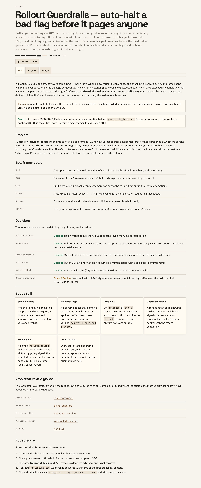
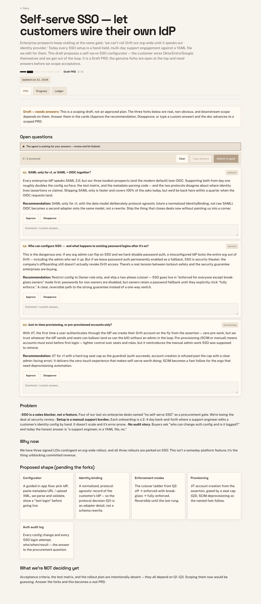

# how-to-work

A single, zero-dependency engine for **how to do work**: turn a fuzzy intent into a
beautiful, gradable PRD — grill the real decisions, scope it, track it through a
lifecycle, and render it as a self-contained HTML doc you can actually look at.

It bundles four things that are really one workflow:

- **Grill** — surface the genuine forks as interactive question cards; the human answers _in the doc_.
- **Scope** — turn intent into a Draft PRD (problem, goal, non-goals, decisions, acceptance).
- **Lifecycle** — Working doc → Draft PRD → Ready → Approved → In execution → Done, shown as a stage bar (no fake percentages).
- **Doc engine** — render concise `.doc.md` sources into gorgeous, self-contained HTML (PRD / Progress / Ledger tabs, components, a live answer-gate).

> **Designed for agents, not humans.** Humans only do two things: prompt an agent, and
> answer grill cards in the rendered doc. Agents drive the `htw` CLI — it's a terse,
> deterministic, machine-readable API, not a human UX.

## Naming

Use **How To Work** for both the engine and the canonical workflow skill.

- Invoke `/how-to-work` for the full PRD/scoping/grill/send-it workflow.
- Use `/how-to` as the short alias in agent UIs.
- Use `/scope` for the quick draft-PRD entrypoint and `/grill` for decision-questioning only.
- `how-we-work` is a legacy compatibility alias for older installs. Do not use it for new prompts, docs, or generated shims.

## What it looks like

Real rendered output — the flagship PRD (stage bar, decisions, scope, tabs) and a scoping
draft with open, answerable grill cards. Everything below is one tiny `.doc.md` source; all
the polish is the shared theme. See the full [examples gallery](examples/GALLERY.md).

| PRD in execution                                                                                                       | Scoping draft — open grill cards                                                                                       |
| ---------------------------------------------------------------------------------------------------------------------- | ---------------------------------------------------------------------------------------------------------------------- |
| [](examples/GALLERY.md#1-prd-in-execution--the-flagship) | [](examples/GALLERY.md#2-scoping-draft--the-grill-mid-flight) |

## Quickstart

```bash
# always-latest, zero install (from GitHub):
npx github:aneym/how-to-work init        # scaffold .agents/skill-config/workflow/config.json
npx github:aneym/how-to-work interfaces  # expose /how-to-work and /how-to in local agent UIs
npx github:aneym/how-to-work new --kind prd --slug my-thing --title "My Thing"
npx github:aneym/how-to-work render docs/prds/my-thing/index.doc.md
npx github:aneym/how-to-work index       # lifecycle dashboard
npx github:aneym/how-to-work serve --answer-gate
npx github:aneym/how-to-work link docs/prds/my-thing/index.html
```

The package is **zero runtime dependencies** — Node built-ins + ESM only. Node ≥ 18.

## Examples

Four real, end-to-end example docs — one per lifecycle stage — live in
[`examples/`](examples/), each with a screenshot of its gorgeous rendered output in the
**[gallery](examples/GALLERY.md)**. They thread together one product story (a feature-flag
platform) so you can watch a single idea move through the whole lifecycle:

| Example                                                       | Stage         | Shows                                                                 |
| ------------------------------------------------------------- | ------------- | --------------------------------------------------------------------- |
| [`working-doc.doc.md`](examples/working-doc.doc.md)           | Working doc   | The lightest entry point — a pre-grill thinking surface.              |
| [`scoping-draft.doc.md`](examples/scoping-draft.doc.md)       | Draft PRD     | Open, answerable `:::questions` grill cards + the answer gate.        |
| [`prd-in-execution.doc.md`](examples/prd-in-execution.doc.md) | In execution  | The flagship — stage bar, decisions, scope, PRD/Progress/Ledger tabs. |
| [`research-report.doc.md`](examples/research-report.doc.md)   | Done (report) | Callouts, a comparison table, and a bespoke SVG diagram.              |

```bash
# render + browse them all
npx github:aneym/how-to-work render examples/prd-in-execution.doc.md
npx github:aneym/how-to-work register --all
npx github:aneym/how-to-work index
npx github:aneym/how-to-work serve --answer-gate
```

See the **[full gallery →](examples/GALLERY.md)** for screenshots of every example (light +
dark mode, the Progress/Ledger tabs, and the lifecycle dashboard).

## The CLI (`htw`)

| Command                     | What it does                                                                      |
| --------------------------- | --------------------------------------------------------------------------------- |
| `htw init`                  | Write the per-repo config bundle; stamp the engine version.                       |
| `htw check`                 | Validate engine version + config schema (CI-friendly, exits non-zero when stale). |
| `htw interfaces`            | Install project-local skills and slash commands for Codex, Claude, and agents.    |
| `htw new`                   | Scaffold a `.doc.md` source (PRD / report / working-doc).                         |
| `htw render`                | Render `.doc.md` → self-contained HTML.                                           |
| `htw register`              | Update the docs catalog (`.json`, or splice a `.ts` catalog).                     |
| `htw index`                 | Emit a static lifecycle dashboard grouped by stage.                               |
| `htw link [path]`           | Print the browser URL for a rendered doc, preferring configured Tailscale.        |
| `htw verify`                | Structural + theme checks on a doc.                                               |
| `htw serve [--answer-gate]` | Loopback static server for `docs/`, optionally mounting the answer-gate.          |
| `htw grill ask`             | Open an ask, block until the human submits answers in the doc, return them.       |

## Gorgeous by default, re-skin per repo

A polished warm-editorial theme ships in the engine (real shadows, optical type scale,
tabular numerals, focus rings, restrained motion) — every doc looks great with zero
per-doc styling. To re-skin a repo, you don't fork the engine:

- `config.doc.themeFile` — replace the theme wholesale, **or**
- `config.doc.themeTokens` — a ~15-line `:root{}` patch overriding the design tokens.

All polish lives in the shared theme; your `.doc.md` stays small.

## The answer-gate

Grill cards POST to a same-origin `/api/hwq` endpoint. Three modes via
`config.answerGate.mode`:

- `none` — copy-answers button works with no server.
- `local` — ship the bundled zero-dependency loopback gate (`htw serve --answer-gate`).
- `custom` — wire your own delivery via the `onAnswer(ask)` callback (e.g. push answers to your own agent runtime).

## Config

One file per repo, in the repo (so it travels): `.agents/skill-config/workflow/config.json`
(falls back to `.claude/skill-config/...`, then bundled defaults). Everything host- or
brand-specific lives here — never in the engine.

`htw init` writes a stable project-specific docs port into `serve.port` and
`devUrlBase`, so multiple product docs servers can run at once without all fighting
for `8765`. To make the closeout link tailnet-friendly, enable Tailscale in that
same config:

```json
{
  "serve": {
    "port": 8766,
    "tailscale": {
      "enabled": true,
      "urlBase": "https://studio.tailf266ac.ts.net:8768"
    }
  }
}
```

When Tailscale is enabled, `htw link <rendered-html>` and the skills prefer that URL
over localhost.

## License

MIT © Alex Neyman
