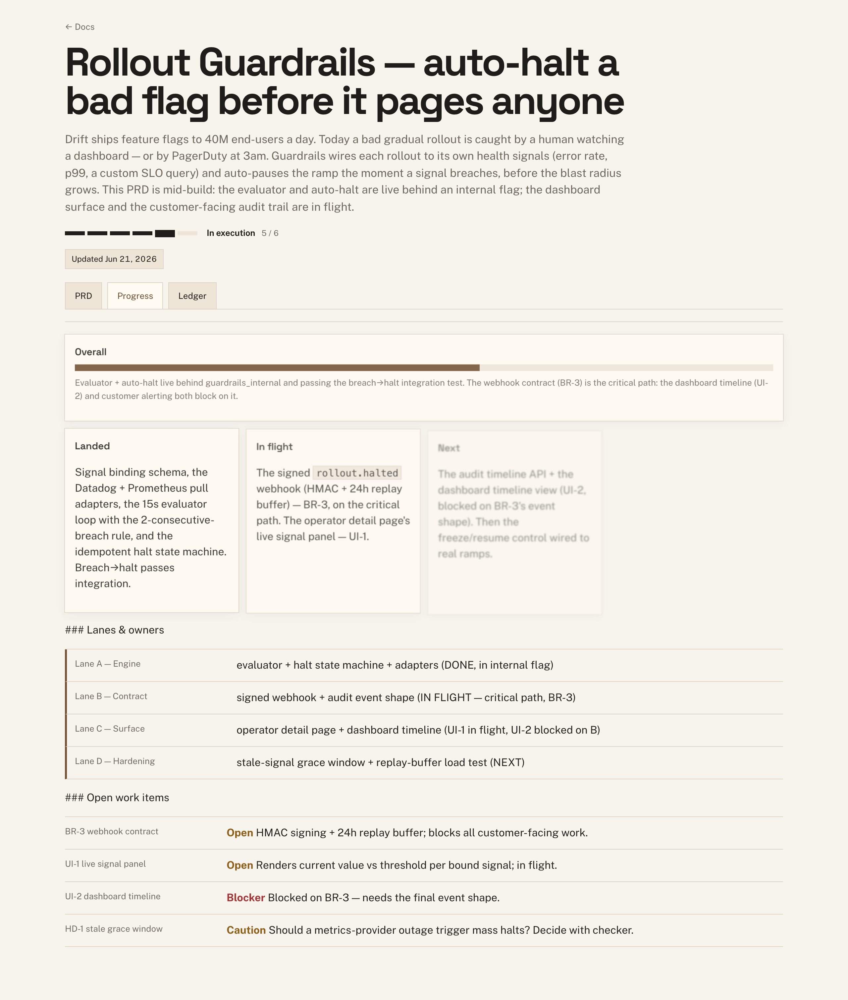
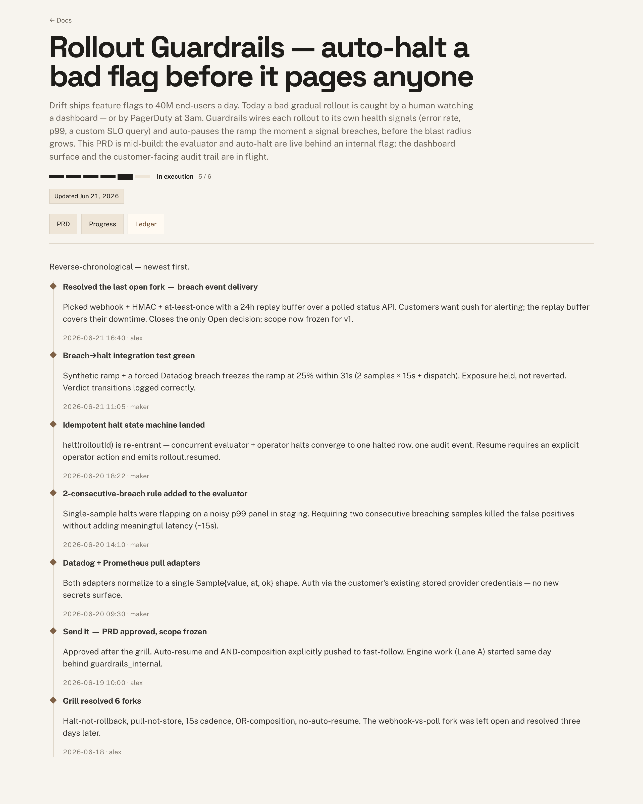
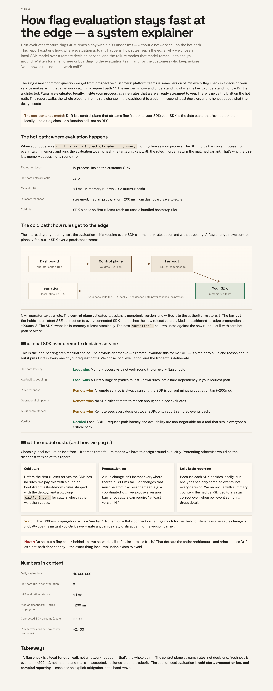
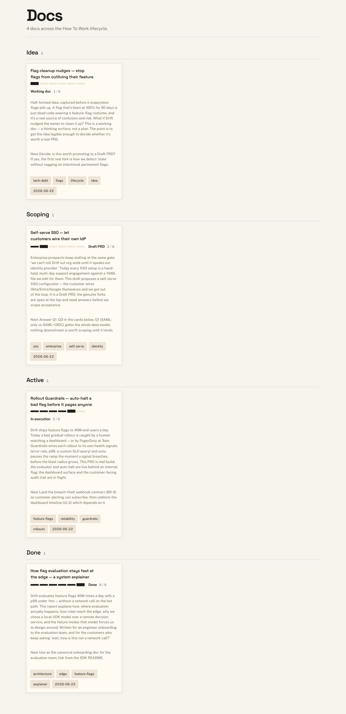
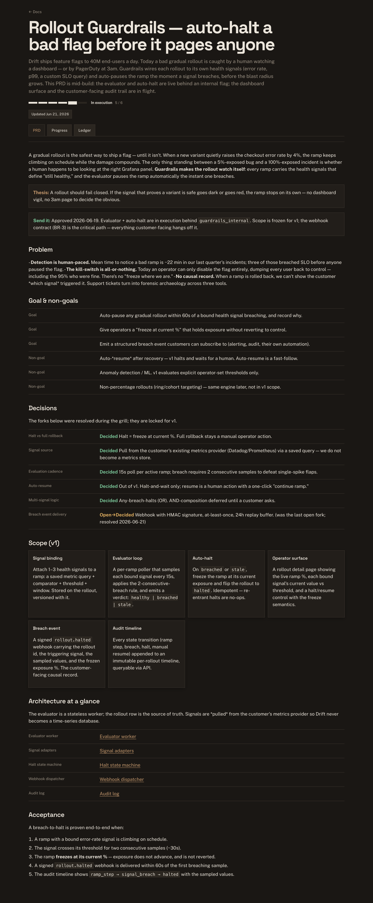

# Gallery

Four real, end-to-end example docs — one per stage of the lifecycle — rendered by the
zero-dependency `htw` engine with the warm-walnut default theme. Every screenshot below is
the **actual rendered HTML**, captured at a 1280px desktop viewport. The sources are tiny
semantic `.doc.md` files (`examples/*.doc.md`); all the polish — layered shadows, staggered
enter, tabular figures, focus rings, the stage bar — comes from the shared theme, not the
markup.

> Render any of these yourself:
> `npx github:aneym/how-to-work render examples/<file>.doc.md`
> then `npx github:aneym/how-to-work serve` and open the doc.

All four threaded together tell one product story — a feature-flag platform called **Drift**
— so you can watch a single idea move through the whole lifecycle: a captured itch becomes a
grilled draft, a grilled draft becomes a sent-it PRD mid-build, and a finished system gets
its explainer.

---

## 1. PRD in execution — the flagship


The whole shell in one doc: a `kind: "prd"` at stage **In execution** with the lifecycle
**stage bar**, the **PRD / Progress / Ledger** tab strip, a green "Send it" banner, resolved
`:::decisions` rows (green for `[Decided]`, amber/red for open/blocked), a `:::cards` scope
grid, a `:::resources` architecture tree, and acceptance criteria. The Progress and Ledger
tabs carry a `:::progress` block, lane/owner phase rows, and a reverse-chronological
`:::ledger` timeline.

- **Stage:** In execution
- **Shows:** stage bar · tabs · decisions · cards · progress · phase rows · ledger timeline
- **Source:** [`examples/prd-in-execution.doc.md`](prd-in-execution.doc.md)
- **Render:** `npx github:aneym/how-to-work render examples/prd-in-execution.doc.md`

| Progress tab                                  | Ledger tab                                |
| --------------------------------------------- | ----------------------------------------- |
|  |  |

---

## 2. Scoping draft — the grill mid-flight


A **Draft PRD** caught at the moment that matters: the three genuine forks (Q1–Q3) are open
`:::questions` cards at the top, each with a Problem, the real tension, and a Recommendation.
Open cards get live **Approve / Disapprove** controls, a custom-answer textarea, and a sticky
**Clear / Copy answers / Submit to agent** action bar. Nothing downstream is scoped yet —
the doc deliberately stops at the grill, because the answers decide the data model.

- **Stage:** Draft PRD
- **Shows:** interactive grill cards · the answer gate · the "answer in the doc" protocol
- **Source:** [`examples/scoping-draft.doc.md`](scoping-draft.doc.md)
- **Render:** `npx github:aneym/how-to-work render examples/scoping-draft.doc.md`

---

## 3. Research report — the doc engine beyond PRDs



A `kind: "report"` system explainer that exercises the doc engine outside the PRD shell:
toned `:::callout` panels (accent / green / amber / red), a `:::cards` grid, a comparison
`:::decisions` table weighing local vs remote evaluation, definition `:::rows` for the
numbers, and a bespoke **SVG box/arrow diagram** via the `:::html` escape hatch using the
theme's `.box` / `.arrow` classes. Flat layout, no tabs — the report kind.

- **Stage:** Done
- **Shows:** callouts · comparison table · cards · SVG diagram · the flat report kind
- **Source:** [`examples/research-report.doc.md`](research-report.doc.md)
- **Render:** `npx github:aneym/how-to-work render examples/research-report.doc.md`

---

## 4. Working doc — the lightest entry point

A `kind: "working-doc"` at stage **Working doc**: a short thinking surface for a half-formed
idea, before it's earned a real PRD. Just enough structure (a status callout, the rough idea,
"open thinking" that isn't yet forks, a why-it-might-be-worth-it `:::rows`) to decide whether
to promote it. This is where the lifecycle starts.

- **Stage:** Working doc
- **Shows:** the lightest doc kind · the pre-grill thinking surface
- **Source:** [`examples/working-doc.doc.md`](working-doc.doc.md)
- **Render:** `npx github:aneym/how-to-work render examples/working-doc.doc.md`

---

## The lifecycle dashboard



`htw index` rolls every registered doc into a static dashboard grouped by lifecycle stage —
Working doc → Draft PRD → … → Done — so the whole body of work reads at a glance. The four
examples above appear here across their stages.

- **Build it:** `npx github:aneym/how-to-work register --all && npx github:aneym/how-to-work index`

---

## Dark mode



The theme ships first-class light **and** dark via `prefers-color-scheme` — no toggle to
author, no second stylesheet. Same flagship PRD, captured with the OS in dark mode: deep
walnut ground, the stage bar, cards and decision rows all adapt.

---

### Reproduce the whole gallery

```bash
npx github:aneym/how-to-work render examples/prd-in-execution.doc.md
npx github:aneym/how-to-work render examples/scoping-draft.doc.md
npx github:aneym/how-to-work render examples/research-report.doc.md
npx github:aneym/how-to-work render examples/working-doc.doc.md
npx github:aneym/how-to-work register --all
npx github:aneym/how-to-work index
npx github:aneym/how-to-work serve --answer-gate   # then open the docs
```
